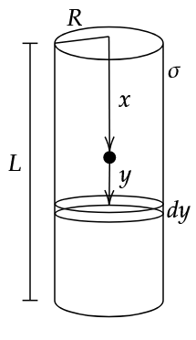

--- 
title: Question 10
description: A long expression
---

#### Q10. Consider a charged non conducting hollow cylinder of surface change density $$\sigma$$, radius $$R$$, and length $$L$$. A particle of mass $$m$$, change $$q$$ is dropped at one end of the tube. Find velocity at a general position $$x$$ from the top of cylinder. Given: $$q\sigma < 0$$. Neglect gravity.

----

#### Idea:
Consider the point to be at some position $$x$$. From there, at a distance $$y$$, consider of thin ring of thickness $$dy$$. Find the force on the particle due to this ring, and hence all such rings by integrating $$y$$ from $$-x$$ to $$L-x$$. We get,

$$F = {\sigma R q \over m \epsilon_0}\left[\frac{1}{\sqrt{R^2 + x^2}} - \frac{1}{\sqrt{R^2 + (L-x)^2}}\right]$$

Here, we can see that maximum velocity is attained at $${L\over2}$$, which can be seen by substituting it in the previous equation.

Now, we can write $$F = ma$$, and solve for $$v$$.

$$v = \sqrt{ {\sigma R q \over m \epsilon_0} \ln\left|\frac{(x+\sqrt{x^2 + R^2})\left((L-x) + \sqrt{(L-x)^2+R^2}\right)}{R(L+\sqrt{L^2 + R^2})}\right|}$$

Which can also be written as, 

$$v =  \sqrt{ {\sigma R q \over m \epsilon_0} \left[ \sinh^{-1} \left( {x \over R} \right) + \sinh^{-1} \left( {L-x \over R} \right) - \sinh^{-1} \left( {L \over R}\right)\right]}$$

Where, $$\sinh^{-1} = \ln \lvert x + \sqrt{x^2 + 1}\rvert$$ by definition.
