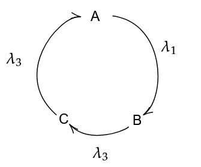

--- 
title: Question 23
description: Cyclic Radioactivity
---

#### Q 23. Consider the following cyclic decay of nuclei, with the given rate constants. Find the quantity of each type of nucleus as a function of time. Assume initially they all start with $$A_0$$, $$B_0$$ and $$C_0$$ of nuclei.

---

#### Solution

Say the quantity of $$A$$ at some time $$t$$ is $$N_A$$, and similarly for $$B$$ and $$C$$.

We can frame the following system of differential equations:

$$\frac{d N_A}{dt} = \lambda_3N_C - \lambda_1N_A$$

$$\frac{d N_B}{dt} = \lambda_1N_A - \lambda_2N_B$$

$$\frac{d N_C}{dt} = \lambda_2N_B - \lambda_3N_C$$

Now, we have to solve these equations.

Note that if we add all three equations, we get:

$$\dot{N}_A + \dot{N}_B + \dot{N}_C = 0$$

$$\implies N_A + N_B + N_C = \text{constant} \overset{\text{def}}{=} n$$

This basically says that if we add up the number of nuclei of all three substances at any time, it must be the same, i.e. it is constant. This means,

$$A_0 + B_0 + C_0 = n$$

$$\implies N_C = n - (N_A + N_B)$$

Substituting this is our first equation, we get

$$\frac{d N_A}{dt} = \lambda_3n - (\lambda_3 + \lambda_1)N_A - \lambda_3N_B$$

Differentiating this with respect to time,

$$\ddot{N}_A = -(\lambda_3 + \lambda_1) \dot{N}_A - \lambda_3 \dot{N}_B$$

We can then substitute the second equation into this to get a linear second order differential equation in $$N_A$$.

$$\ddot{N}_A + \alpha \dot{N}_A + \beta N_A = \lambda_2 \lambda_3 n$$

Where, 

$$\alpha = \lambda_1 + \lambda_2 + \lambda_3$$

$$\beta = \lambda_1\lambda_2 + \lambda_2\lambda_3 + \lambda_3\lambda_1$$

We can rearrange the equation as so,

$$\ddot{N}_A + \alpha \dot{N}_A + \beta \left( N_A - {\lambda_2 \lambda_3 \over \beta }n \right) = 0$$

We now define,

$$X_A = \left( N_A - {\lambda_2 \lambda_3 \over \beta }n \right)$$

We do this in order to remove the constant. Also,

$$E_A \overset{\text{def}}{=} {\lambda_2\lambda_3 \over \beta } n$$

And similarly for $$E_B$$ and $$E_C$$. These are the equilibrium values for the nuclei, i.e. their final quantities at time $$t = \infty$$.

Hence, our equation becomes,

$$\ddot{X}_A + \alpha \dot{X}_A + \beta X_A = 0$$

The solution for this is known as

$$X_A = c_1e^{\tau_1t} + c_2 e^{\tau_2t}$$

Where $$\tau_1$$, $$\tau_2$$ are defined as

$$\tau_1,\tau_2 = \frac{-\alpha \pm \sqrt{\alpha^2 - 4\beta}}{2}$$

We can solve for $$c_1$$ and $$c_2$$ by substituting appropriate initial conditions.

The solution is given in this desmos plot, with a little extra terms, since desmos can't directly register the imaginary constant in the function, and hence we must split it into 3 parts: Underdamped, Critically damped and overdamped cases. Note that they are slightly different, but this change is only due to the fact that $$\alpha^2-4\beta$$ may be positive or negative, giving imaginary numbers. Note that regardless of it being imaginary, the final function as a whole is always real.

[Plot](https://www.desmos.com/calculator/bc9sdluxht)

---
