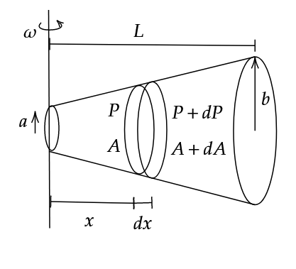

#### Q6. Consider a hollow frustum, closed on both ends. An ideal gas of molar mass M and temperature T is inside it. It is rotated about its short end with constant angular velocity $$\omega$$. The radius on its left end is $$a$$, and its right end is $$b$$. Pressure on its left end is $$P_0$$. The total length is $$L$$. Find pressure profile. ($$P(x)$$)

---

#### Idea:

Each small part has circular motion. Hence, we can apply the following formula for an infinitesimally small section and integrate over it to find the pressure profile

$$F = m R \omega^2\tag1$$

We also have the ideal gas equation, $$PV = nRT$$ with us, but we shall use its modified form

$$PM = \rho R T\tag2$$

---
#### Solution:

We shall first solve the question generally for any $$A(x)$$.

Using eq. (1), we have,

$$(P+dP)(A+dA) - PA = (dm) x \omega^2\tag3$$

$$AdP + PdA = \rho A x (dx) \omega^2$$

Substituting $$\rho = \frac{PM}{RT}$$ from (2),

$$AdP + PdA = \frac{PM}{RT} A \omega^2 x dx$$

$$\implies \int_{P_0}^{P} \frac{dP}{P} + \int_{A_0}^{A} \frac{dA}{A} = \frac{M\omega^2}{RT} \int_{0}^{x} x dx$$

$$\ln \left( \frac{PA}{P_0 A_0} \right) = \frac{M \omega^2 x^2}{2RT}$$

$$\therefore P = \frac{P_0 A_0}{A} e^{\frac{M \omega^2 x^2}{2RT}}\tag4$$

Where, $$A$$ and $$A_0$$ are functions of $$x$$. 

Now, according to the question, we have,

$$r = \left( \frac{b-a}{L} \right) x + a$$

$$\implies A = \pi r^2 = \pi \left( \left( \frac{b-a}{L} \right) x + a \right)^2$$

$$A_0 = \pi a^2$$

Substituting these values into (4),

$$p = \frac{P_0 a^2 L^2}{\left( (b-a) x + aL \right) ^2} e^{\frac{M \omega^2 x^2}{2RT}}$$

---

Note that in (3), we neglected $$dAdP$$ as it is negligibly small. If, to the contrary, we had indeed considered it, we would get an extra factor as shown.

$$\therefore P = \frac{P_0 A_0}{A} \left(\frac{A}{A_0}\right)^{\ln \frac{P_0}{P}} e^{\frac{M \omega^2 x^2}{2RT}}\tag5$$

The proof for eq. (5) is left as an exercise to the reader.

---

