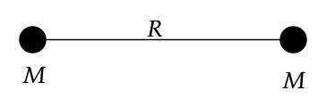
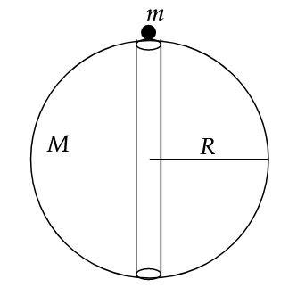

#### Q9. To find the time of collision of two (point sized) bodies kept at a distance $$R$$ from each other, initially at rest, having equal masses $$M$$. 

----

#### Idea:
Clearly, since the masses are equal, their centre of mass lies at their geometrical centre, which would be the point at which they collide. This is because there is no external force acting on this system. This implies the centre of mass is stationary. 

Consider a general instant at which the bodies are at a distance $$r$$ away from each other. Here, we can write the gravitational potential energy and apply conservation of energy, hence finding velocity as a function of position $$r$$. From this, we write $$v = {dx \over dt}$$ and integrate as $$r$$ varies from $$R$$ to $$0$$, and time varies from $$0$$ to $$t$$.

----

#### Answer:

$$t = \frac{\pi}{2} \sqrt{\frac{R^3}{2GM}}$$

----

#### Q9(b). Consider a hole dug through the Earth(diametrically) of negligible radius. Now, we drop a small point sized body of mass $$m$$. Find the time taken for it to reach the other side. Consider the Earth to be of uniform density $$\rho$$, its mass to be $$M$$, and its radius $$R$$. Neglect air resistance.

Interestingly, when we solve it, in a similar fashion to the question above, we get this:

$$t = \pi \sqrt{R^3 \over G M}$$

Note that the mass of the point body is irrelevant. Substituting relevant values, we get,

$$t \approx 2535 \text{ s} \approx 42 \text{ min and } 15 \text{ s}$$
